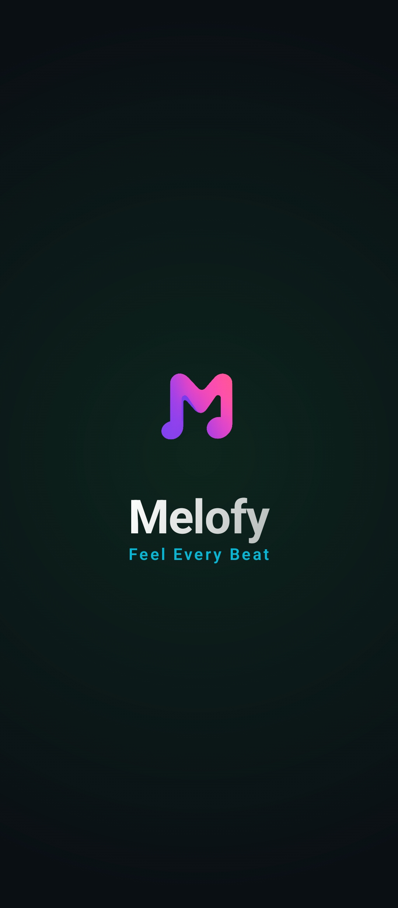
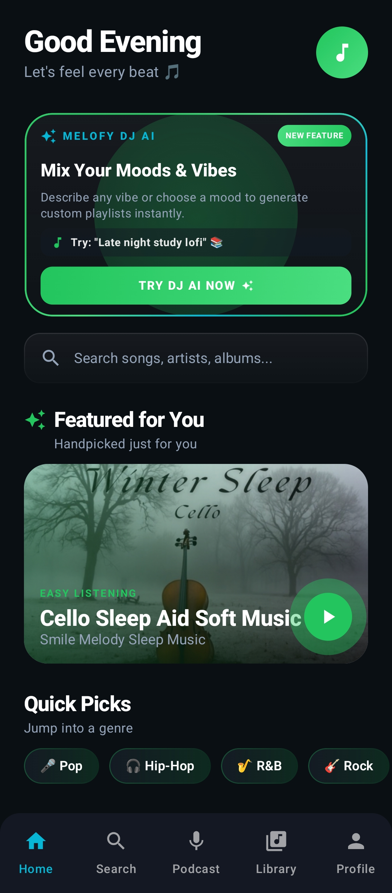
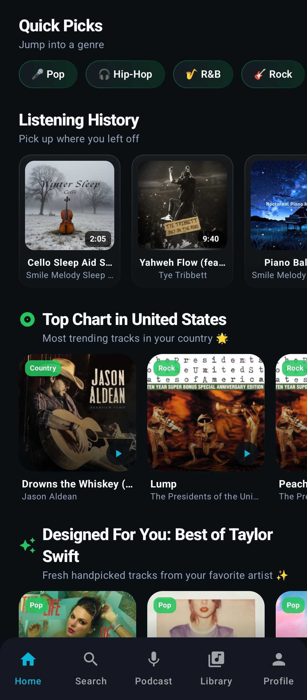
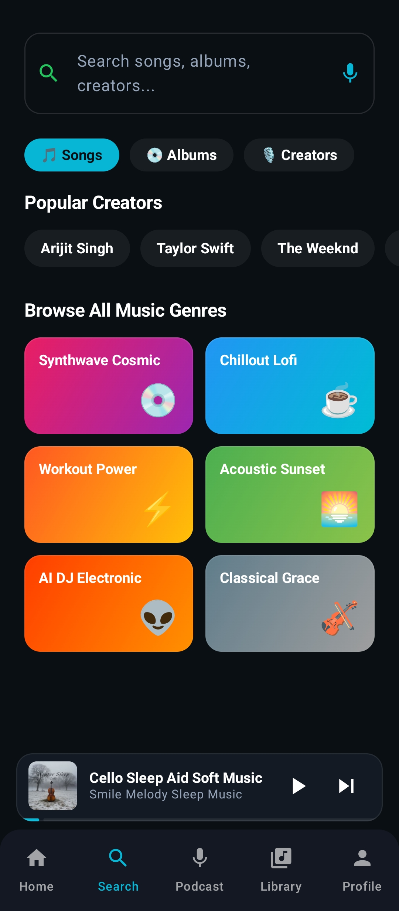
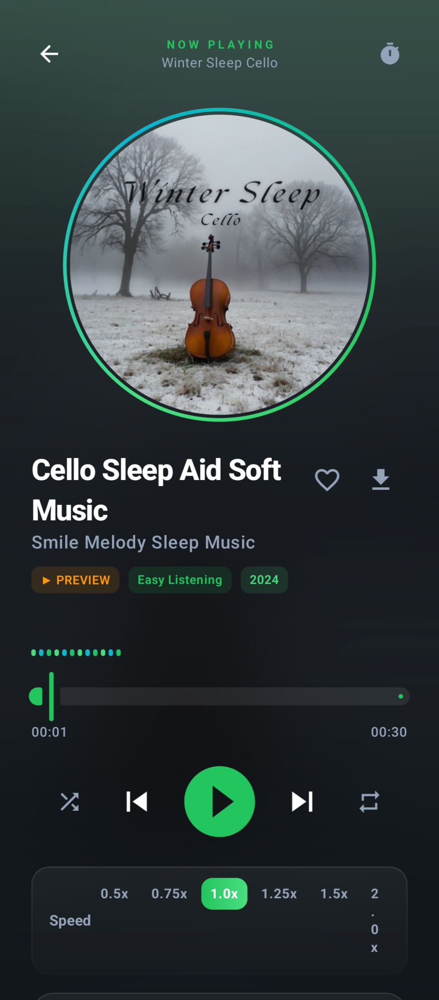
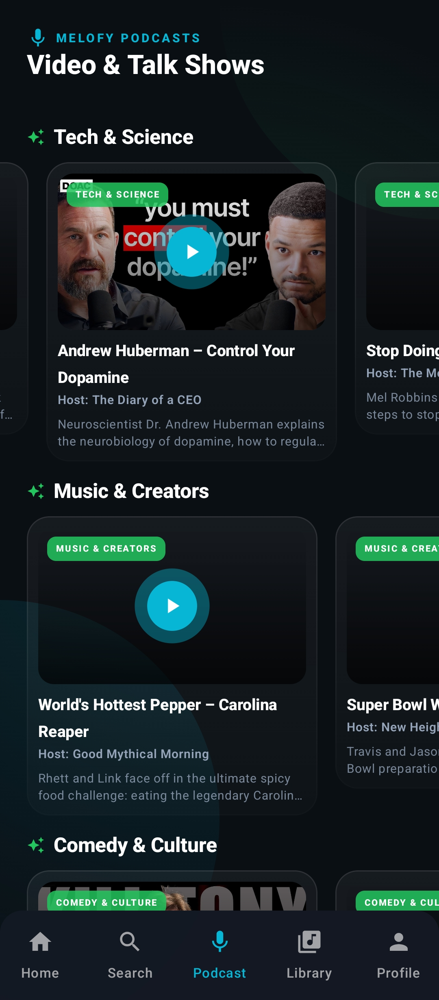
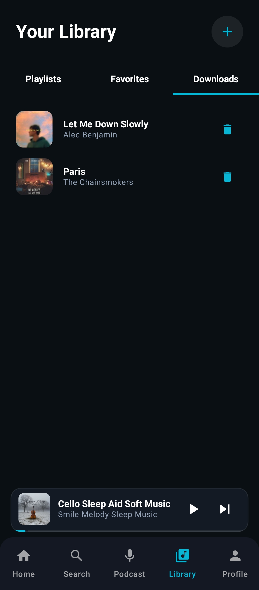
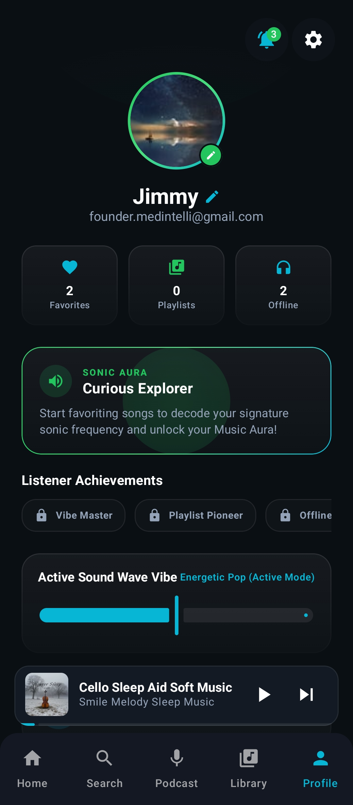

# 🎧 Melofy

<div align="center">

# 🎵 Cyberpunk Music & Podcast Streaming App

Modern Android music and podcast streaming experience built with **Kotlin**, **Jetpack Compose**, **Clean Architecture**, **Hilt**, and futuristic **Cyberpunk UI** design.

<p>


</p>

### 🚀 AI Powered • Voice Search • Music Streaming • Podcast Platform

</div>

---

# ✨ Overview

Melofy is a premium Android streaming application designed to deliver a futuristic media experience.

The application combines:

* 🎵 High-quality music playback
* 🎙 Podcast streaming
* 🤖 AI DJ recommendations
* 🎤 Voice-powered search
* ✨ Glassmorphism UI
* 🌈 Dynamic gradients
* ⚡ Smooth animations
* 🚀 Modern Android architecture

Built completely with Jetpack Compose and modern Android development best practices.

---

# 📸 Screenshots

## 🚀 Splash Screen

<p align="center">
  
</p>

---

## 🏠 Home Experience

<p align="center">
  
  
</p>

---

## 🔍 Search & Discovery

<p align="center">
  
</p>

---

## 🤖 AI DJ Assistant

<p align="center">
  
</p>

---

## 🎵 Music Player

<p align="center">
  
</p>

---

## 🎙 Podcast Streaming

<p align="center">
  
</p>

---

## 📚 Library

<p align="center">
  
</p>

---

## 👤 User Profile

<p align="center">
  
</p>

---

# ✨ Key Features

## 🎵 Music Streaming

* High quality audio playback
* Queue management
* Background playback
* Floating mini-player
* Animated seek controls
* Playlist support

## 🎙 Podcast Platform

* Podcast discovery
* YouTube integration
* HD playback support
* Playback speed controls
* Fullscreen support

## 🤖 AI DJ Assistant

* Personalized recommendations
* Mood-based suggestions
* Dynamic queue generation
* Smart listening insights

## 🎤 Voice Search

* Speech-to-text support
* Artist discovery
* Hands-free navigation
* Quick search experience

## 🎨 Cyberpunk UI

* Glassmorphism cards
* Neon glow effects
* Animated gradients
* Dynamic transitions
* Modern typography
* Smooth Compose animations

---

# 🏗 Architecture

Melofy follows **MVVM + Clean Architecture** principles.

```text
Presentation Layer
│
├── Jetpack Compose
├── Navigation
├── ViewModels
│
Domain Layer
│
├── Models
├── Use Cases
├── Repository Contracts
│
Data Layer
│
├── Repository Implementations
├── Local Data Sources
├── Remote Data Sources
│
Infrastructure
│
├── Hilt
├── Coroutines
├── Flow
├── Coil
└── Media Services
```

---

# 📂 Project Structure

```text
app/
│
├── data/
│   ├── repository/
│   ├── datasource/
│   └── model/
│
├── domain/
│   ├── model/
│   ├── repository/
│   └── usecase/
│
├── ui/
│   ├── screens/
│   ├── components/
│   ├── theme/
│   └── viewmodel/
│
├── playback/
│
├── di/
│
└── MainActivity.kt
```

---

# 🛠 Tech Stack

| Technology         | Purpose              |
| ------------------ | -------------------- |
| Kotlin             | Main Language        |
| Jetpack Compose    | Modern UI            |
| Material 3         | Design System        |
| Hilt               | Dependency Injection |
| Coroutines         | Async Programming    |
| Flow               | Reactive Streams     |
| Navigation Compose | Navigation           |
| Coil               | Image Loading        |
| WebView            | Podcast Playback     |
| YouTube Iframe API | Video Streaming      |

---

# 🚀 Getting Started

## Clone Repository

```bash
git clone https://github.com/OverflowX-tech/melofy.git
```

## Navigate to Project

```bash
cd melofy
```

## Build Project

```bash
./gradlew build
```

## Install Debug APK

```bash
./gradlew installDebug
```

---

# 📋 Requirements

* Android Studio Jellyfish+
* JDK 17+
* Android SDK 34+
* Gradle 8+

---

# 🌟 Future Roadmap

* [ ] Spotify Integration
* [ ] Dynamic Lyrics
* [ ] Offline Downloads
* [ ] Android Auto Support
* [ ] Wear OS Support
* [ ] Material You Themes
* [ ] Cloud Sync
* [ ] Social Sharing

---

# 🤝 Contributing

Contributions are welcome.

1. Fork the repository
2. Create a feature branch
3. Commit your changes
4. Push to GitHub
5. Open a Pull Request

---

# 📄 License

MIT License

---

# 👨‍💻 Developer

### OverflowX Tech

Building modern Android experiences with Kotlin and Jetpack Compose.

⭐ If you like this project, consider giving it a star.
